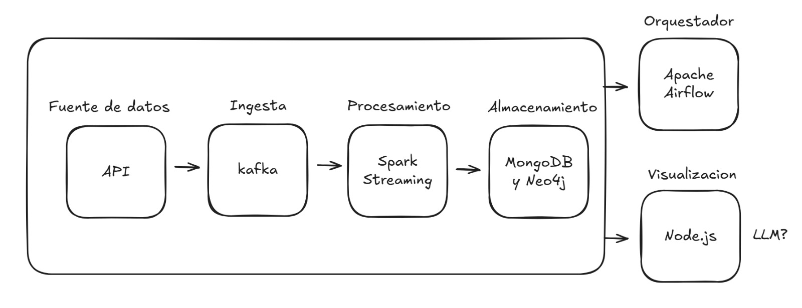

# ⚽ Big Data Project 📊

## 🚀 Introducción y Justificación del Problema a Resolver
Este proyecto tiene como objetivo analizar y procesar datos de fútbol provenientes de la [repo de StatsBomb](https://github.com/statsbomb/open-data.git). El dataset contiene información clave de eventos, alineaciones, partidos y competiciones, lo que nos permite realizar un análisis profundo sobre el rendimiento de equipos y jugadores en diferentes temporadas y competiciones. Esta información es valiosa tanto para entrenadores como para analistas deportivos, que pueden usarla para identificar patrones, prever resultados y mejorar estrategias.

La implementación sigue una arquitectura de Big Data que permite procesar estos datos en tiempo real, lo que significa que podemos analizar los partidos mientras están en curso o incluso procesar grandes volúmenes de datos históricos para obtener información relevante. Además, la visualización de estos datos es esencial para la toma de decisiones, ya que facilita la comprensión de los patrones y resultados obtenidos del análisis.

Este proyecto involucra la aplicación de múltiples herramientas y tecnologías que permiten el procesamiento de grandes volúmenes de datos a gran escala, lo que es un reto en sí mismo. La solución desarrollada permitirá manejar tanto los datos estructurados como los no estructurados, y proveerá una base sólida para análisis avanzados.

---

## 📂 Descripción del Dataset, Origen y Tamaño de Data
El dataset utilizado proviene de la repo pública de [StatsBomb Open Data](https://github.com/statsbomb/open-data.git), la cual contiene una rica colección de datos deportivos. Específicamente, el dataset incluye:

- **⚽ Events**: Información detallada sobre los eventos durante los partidos, como goles, asistencias, tarjetas, cambios y más. Esta información es crucial para entender cómo se desarrolla un partido.
- **🧑‍🤝‍🧑 Lineups**: Los jugadores que participaron en cada partido, junto con sus respectivas alineaciones. Esto es importante para analizar la relación entre la formación del equipo y los resultados obtenidos.
- **🏟️ Matches**: Datos generales sobre cada partido, incluyendo equipos, fecha y lugar de juego, entre otros. Esto permite contextualizar los eventos y acciones de cada partido.
- **🔄 Three-sixty**: Información enriquecida sobre las jugadas, incluyendo estadísticas de posicionamiento y dinámica de los jugadores durante los partidos.
- **📄 Competitions.json**: Detalles de las competiciones en las que se jugó cada partido, lo que es útil para analizar las diferencias en los rendimientos según la liga o torneo.

El tamaño del dataset es significativo, ya que cubre múltiples temporadas y competiciones a nivel global. Esto implica que es necesario un enfoque de procesamiento distribuido para manejar la magnitud y complejidad de los datos, además de realizar análisis en tiempo real para obtener insights precisos.

---

## 🛠️ Dificultad Técnica
El desafío principal en este proyecto radica en el procesamiento y análisis de grandes volúmenes de datos en tiempo real. Debido a la naturaleza del dataset, que incluye datos complejos y altamente detallados, se debe implementar un pipeline eficiente que pueda procesar estos datos de manera rápida y escalable. Algunas de las dificultades técnicas que enfrentamos son:

- **Procesamiento en tiempo real**: El dataset es muy grande, y algunos de los datos que queremos analizar están relacionados con eventos en tiempo real (por ejemplo, los goles en los partidos). Esto requiere el uso de herramientas que puedan manejar y procesar información en tiempo real de manera eficiente.
- **Integración de múltiples tecnologías**: Dado que estamos utilizando varias herramientas y tecnologías como Kafka para la ingesta, Dask para el procesamiento y DynamoDB para almacenamiento, se requiere un enfoque cuidadoso para integrar estas herramientas de forma que trabajen bien juntas.
- **Escalabilidad y rendimiento**: A medida que aumentan los datos, la solución debe ser capaz de escalar sin perder rendimiento, lo que implica optimizar el código y los procesos, además de aprovechar las capacidades de infraestructura en la nube (en este caso, AWS).

---

## 🧰 Herramientas y/o Tecnologías Empleadas
El proyecto utiliza una variedad de herramientas y tecnologías que nos permiten manejar los diferentes aspectos del pipeline de Big Data. Estas son las principales herramientas empleadas:

- **Ingesta**: Kafka 🪄  
Kafka se utiliza para gestionar la ingesta de datos en tiempo real. Es ideal para manejar grandes volúmenes de datos que necesitan ser procesados a medida que se generan, como los eventos en un partido de fútbol.
  
- **Procesamiento**: Dask ⚡  
Dask es la herramienta clave para procesar los datos. A diferencia de Spark, Dask es más adecuado para tareas que requieren un procesamiento distribuido en entornos de recursos limitados. Dask nos permite manejar el procesamiento paralelo de grandes volúmenes de datos de manera eficiente, utilizando un enfoque más flexible en comparación con otros frameworks.

- **Almacenamiento**: DynamoDB 🍃  
Para almacenar los datos procesados, utilizamos DynamoDB, que es una base de datos NoSQL en la nube de AWS. DynamoDB es ideal para manejar datos que no tienen una estructura fija y que deben ser consultados rápidamente.

- **Orquestación**: Apache Airflow ☁️  
Apache Airflow se utiliza para orquestar el flujo de trabajo en el pipeline. Nos permite gestionar las dependencias entre los diferentes pasos del proceso, como la ingesta, el procesamiento y el almacenamiento de los datos.

- **Visualización**: Node.js 📊  
Node.js es utilizado para la visualización de los resultados del análisis. Con esta herramienta podemos crear dashboards interactivos que muestran insights relevantes de manera gráfica, lo cual es útil para explorar los datos de una forma más intuitiva.

- **Infraestructura**: AWS ☁️  
La infraestructura se maneja a través de AWS, utilizando servicios como S3 para almacenamiento de archivos y DynamoDB para la base de datos, lo que nos permite una alta disponibilidad y escalabilidad de la solución.

---

## ▶️ Indicaciones de cómo ejecutar el proyecto

### 🖥️ Entorno virtual

#### Windows
```bash
.\venv\Scripts\activate
python -m venv venv
```

#### Linux
```bash
python3 -m venv venv
source venv/bin/activate
```

#### Instalar dependencias 📦
```bash
pip install -r requirements.txt
```

---

## 🐳 Docker para Kafka
```bash
docker network create kafka-net
docker run --name zookeeper --network kafka-net -p 2181:2181 -d zookeeper
docker run -p 9092:9092 --name kafka --network kafka-net -e KAFKA_ZOOKEEPER_CONNECT=zookeeper:2181 -e KAFKA_ADVERTISED_LISTENERS=PLAINTEXT://localhost:9092 -e KAFKA_OFFSETS_TOPIC_REPLICATION_FACTOR=1 -d confluentinc/cp-kafka 
```

---

## 🗂️ Arquitectura del Proyecto



## 🔍 Descripción de la Arquitectura
La arquitectura del proyecto está basada en un enfoque de procesamiento distribuido y en tiempo real. Aquí te explicamos cada uno de los componentes clave:

- **📡 Fuente de Datos**: Los datos provienen de la API pública de StatsBomb, la cual proporciona información sobre partidos, jugadores y eventos en tiempo real.
- **📥 Ingesta**: Utilizamos Kafka para la ingesta de datos, que nos permite gestionar y transmitir los datos de manera eficiente desde la fuente hasta el sistema de procesamiento.
- **⚙️ Procesamiento**: Los datos son procesados en paralelo y distribuidos utilizando Dask. Esto nos permite aplicar transformaciones como la limpieza, el enriquecimiento de los datos y la agregación de métricas en tiempo real.
- **💾 Almacenamiento**: Los datos procesados se almacenan en DynamoDB, lo que nos permite escalabilidad y consultas rápidas sobre grandes volúmenes de datos.
- **📋 Orquestación**: Apache Airflow se encarga de coordinar los diferentes pasos del proceso ETL/ELT, asegurando que las dependencias entre los datos y los procesos se gestionen de manera efectiva.
- **📊 Visualización**: Node.js se encarga de mostrar los resultados del análisis en dashboards interactivos que permiten a los usuarios finales explorar y comprender los datos de manera intuitiva.

---

## 🔄 Descripción del Proceso ETL/ELT
- **🛠️ Extracción**: Los datos se extraen de la API de StatsBomb mediante Kafka, que gestiona la transmisión de eventos en tiempo real.
- **🔧 Transformación**: Con Dask, los datos son limpiados, transformados y enriquecidos. Esto incluye tareas como la normalización de campos, la creación de métricas agregadas y la eliminación de datos erróneos.
- **💾 Carga**: Los datos transformados son almacenados en DynamoDB, lo que permite un acceso rápido y escalable a los datos para consultas posteriores.

---

## 📈 Resultados Obtenidos y Análisis de Estos
*(Falta completar con los resultados específicos del análisis realizado, como estadísticas clave de jugadores, equipos o competiciones.)*

---

## ⚠️ Dificultades Identificadas al Momento de Implementar la Solución
*(Falta completar con los desafíos técnicos encontrados en la implementación, como problemas con la integración de Kafka, la optimización del procesamiento en Dask, o dificultades en la implementación en la infraestructura de AWS.)*

---

## 📝 Conclusiones y Posibles Mejoras
*(Falta completar con las conclusiones finales del proyecto, lecciones aprendidas y posibles mejoras, como la expansión del sistema con LLMs para el análisis de texto o la integración con otras fuentes de datos.)*